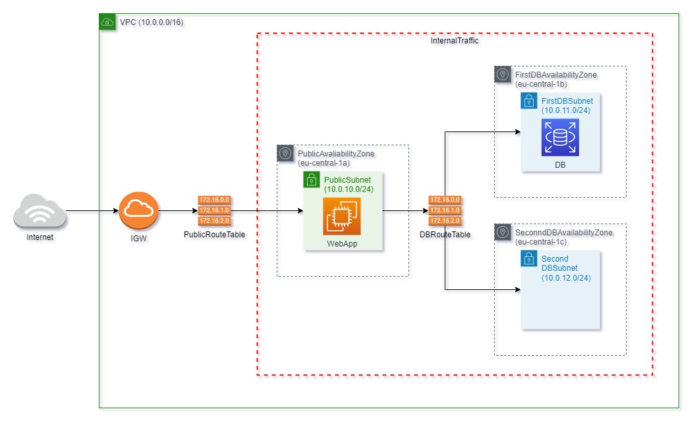
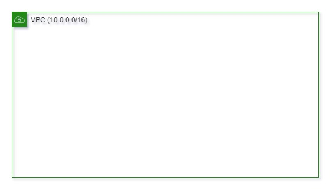
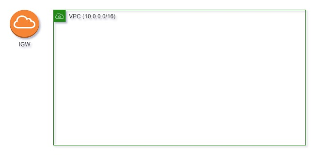
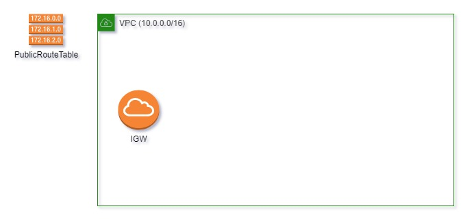
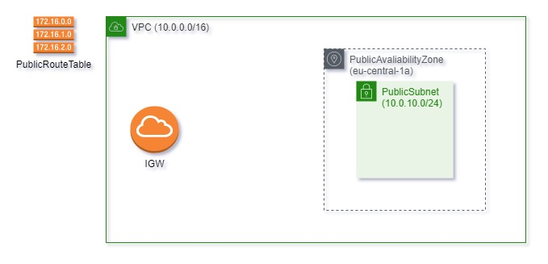
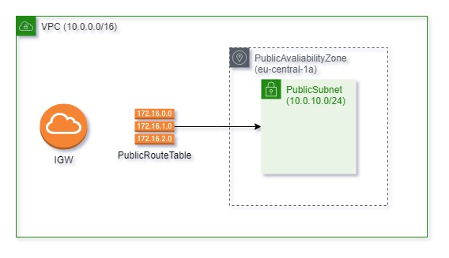
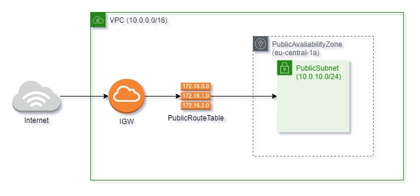

# Practical guide EC2 + RDS with CloudFormation

## Introducing

This article shows how to provision AWS infrastructure for a web-app with database by using CloudFormation.

Let's jump right in!

## Fast track for mature guys

For those, how is aware how to deploy apps in AWS or for those, how hate to read:
Welcome to the [github folder](CF-templates)

## Design

We are going to configure the following schema:
<div>
      
  
  
</div>
<br>

Down below, I explain each of the component from the design with pictures, ~~cats,~~code, and my bad English

## Creating infrastructure

I've made the `CF-vpc.yaml` CloudFormation [template](CF-templates/CF-vpc.yaml) which is responsible for infrastructure
There are couple details that I would like to describe:
 1. The `IGW`(InternetGateway) allow us to accept traffic from the internet.
 2. The `PublicRouteTable` associates the traffic from IGW to our `PublicSubnet`, so the `WebApp` is happy to receive requests.
 3. The `DBRouteTable` associates with private subnets and covers by `InternalTraffic` security group, as a result, `DB` can be called by `WebApp` instance. 
 4. The `WebApp` connects to the `DB` as he is a part of `VPC`.
> **_NOTE:_**  There are two private subnets, because AWS required to have at least two subnets for RDS instances.

To many words, no code and just one big picture on top. Sounds bad.
Let's fix it! 
For example, we take a look how the point 2 could be configured by CloudFormation and visualized by schemas.

* First things first we need to create the `VPC`
```yaml
Parameters:
  VPCCidrBlock:
    Type: String
  ...
Resources:
  VPC:
    Type: AWS::EC2::VPC
    Properties:
      CidrBlock: !Ref VPCCidrBlock
  ...
```
<div>
      
  
  
</div>
<br>

* Creating the `InternetGateway`. As you can see it's attached to nothing, that's why the `IGW` outside the `VPC`
```yaml
Resources:
  IGW:
    Type: AWS::EC2::InternetGateway
    Properties: {}
  ...
```
<div>
      
  
  
</div>
<br>

* Here we go, now the `IGW` has been attached to our `VPC`
```yaml
Resources:
  VPCInternetGatewayAttachment:
    Type: AWS::EC2::VPCGatewayAttachment
    Properties:
      InternetGatewayId: !Ref IGW
      VpcId: !Ref VPC
  ...
```
<div>
      
  
  
</div>
<br>

* The `RoutTable` will help us to connect to a `Subnet`, for now is just stays in the `VPC`
```yaml
Resources:
  PublicRouteTable:
    Type: AWS::EC2::RouteTable
    Properties:
      VpcId: !Ref VPC
  ...
```
<div>
      
  
  
</div>
<br>

* The `Subnet` which is has a range of addresses and placed into `VPC` with an `AvailabilityZone`
```yaml
Parameters:
  PublicAvaliabilityZone:
    Type: AWS::EC2::AvailabilityZone::Name
  PublicCidrBlock:
    Type: String
  ...
Resources:
  PublicSubnet:
    Type: AWS::EC2::Subnet
    Properties:
      AvailabilityZone: !Ref PublicAvaliabilityZone
      CidrBlock: !Ref PublicCidrBlock
      VpcId: !Ref VPC
      MapPublicIpOnLaunch: true # This will indicate that all instances launched on the subnet receive public IPv4 addresses  
  ...
```
<div>
      
  
  
</div>
<br>

* The step when we make a bridge between `RoutTable` and our `Subnet`
```yaml
Resources:
  PublicSubnetRouteTableAssociation: 
    Type: AWS::EC2::SubnetRouteTableAssociation
    Properties:
      RouteTableId: !Ref PublicRouteTable
      SubnetId: !Ref PublicSubnet
  ...
```
<div>
      
  
  
</div>
<br>

* The bridge between `RoutTable` and our `IGW`(Just an arrow between those two)
```yaml
Resources:
  PublicIGWRoute:
  Type: AWS::EC2::Route
    Properties:
      GatewayId: !Ref IGW
      RouteTableId: !Ref PublicRouteTable
      DestinationCidrBlock: 0.0.0.0/0
  ...
```
<div>
      
  
  
</div>
<br>

* And finally the `SecurityGroup` opens the traffic from the internet
```yaml
Resources:
  PublicTraffic:
    Type: AWS::EC2::SecurityGroup
    Properties:
      VpcId: !Ref VPC
      SecurityGroupIngress:
        CidrIp: 0.0.0.0/0
        FromPort: 8080
        ToPort: 8080
        IpProtocol: tcp
      GroupDescription: public access
  ...
```
<div>
      
  
  
</div>
<br>


> **_Sum up_**
> 
> The steps above shows how the different types of AWS Resources interact with each other. 
>
> Some of them need to create objects(`AWS::EC2::RouteTable`) other is need to make relationships(`AWS::EC2::SubnetRouteTableAssociation`)

## Configure RDS

The CloudFormation stack with the environment has been configured.
Let's configure `DB` to put it in `FirstDBSubnet` by creating a separate CloudFormation template.

The following configuration is provided within the `CF-db.yaml` [file](CF-templates/CF-db.yaml)

Most likely we just need to specify the database parameters such as storage, engine, and other database specifics as well as credentials
But I would like to highlight the `VPCSecurityGroups`, so the `DB` will not be totally deaf, and at least `WebApp`(that's all we need) will be able to query it since they both belong to the `InternalTraffic`
```yaml
Parameters:
  InternalTraffic:
    Type: AWS::EC2::SecurityGroup::Id
  ...
Resources:
  DB:
    Type: AWS::RDS::DBInstance
    Properties:
      ...
      VPCSecurityGroups:
        - !Ref InternalTraffic
  ...
```

One more thing, the two private `Subnet` for `DB` have to be specified together by `DBSubnetGroup` 

```yaml
Parameters:
  FirstDBSubnet:
    Type: AWS::EC2::Subnet::Id
  SecondDBSubnet:
    Type: AWS::EC2::Subnet::Id
  ...  
Resources:
  DBSubnetGroup:
    Type: AWS::RDS::DBSubnetGroup
    Properties:
      DBSubnetGroupDescription: Access to db
      SubnetIds:
        - !Ref FirstDBSubnet
        - !Ref SecondDBSubnet
  ...
```

## Configure EC2

Last but not least, we need to configure `WebApp` for `PublicSubnet` by creating a separate CloudFormation template

The following configuration provided within the `CF-app.yaml` [file](CF-templates/CF-app.yaml)

I insist on looking a bit closer to the `WebApp` Resources
I will walk you through each Property
```yaml
Parameters:
  PublicSubnet:
    Type: AWS::EC2::Subnet::Id
  InternalTraffic:
    Type: AWS::EC2::SecurityGroup::Id
  PublicTraffic:
    Type: AWS::EC2::SecurityGroup::Id
  ...
Resources:
  WebApp:
    Type: AWS::EC2::Instance
    Properties:
      SecurityGroupIds:
        - !Ref InternalTraffic
        - !Ref PublicTraffic
      SubnetId: !Ref PublicSubnet
      InstanceType: t2.micro
      IamInstanceProfile: !Ref WebAppInstanceProfile
      ImageId: ami-0a261c0e5f51090b1
      UserData:
        Fn::Base64:
          !Sub |
          #!/bin/bash
          mkdir java
          cd java
          sudo yum install java-17-amazon-corretto-devel -y
      Tags:
        - Key: "EC2Instance"
          Value: "WebApp"
  ...
```
Properties:
- `SecurityGroupIds`: `InternalTraffic` to connect to the `DB`, `PublicTraffic` to receive calls from the internet
- `SubnetId`: Inject the `WebApp` to `PublicSubnet` configured in **Creating infrastructure** charter
- `InstanceType`: The free tier eligible type. 
- `IamInstanceProfile`: The Roles that could be attached to your EC2 instance to call other AWS services.
- `ImageId`: I will use the System Manager, that's required to have the TLS certificate for an instance. All AWS AMI already have TLS certificates ([AWS docs](https://docs.aws.amazon.com/systems-manager/latest/userguide/setup-launch-managed-instance.html)), so I've picked up one of them(That's why I hardcoded this one)
- `UserData`: The property allows us to run a shell script on the startup of an instance. So you probably have an idea to write the script which will run your app, but I think the provisioning infrastructure process and deploying application process could change for different reasons at different time, so they have to be strongly decoupled. I use `UserData` to provision infrastructure by preinstalling jdk. For the deployment, I will use System Manager(in nutshell SSM provides the ability to run scripts on your instances)
- `Tags`: The tag helps to identify the instance in the future on the deployment process.


`IamInstanceProfile` could be huge and mysterious. I've split into the pieces for you:

The object is just a set of `Roles` for your instance. By the way, I have an article with an explanation of `Roles` by examples with the [dogs](https://medium.com/@pichkasik.dev/aws-iam-explaining-with-dogs-9141c9170cd1).
```yaml
Resources:
  WebAppInstanceProfile:
    Type: AWS::IAM::InstanceProfile
    Properties:
      Roles:
        - !Ref WebAppRole
  ... 
```

`WebAppRole` - consists of two policies. They present a bad and good example respectively.
The `WebAppSSMPolicyArn` - needs to execute scripts in the instance by SSM. It's a bad `Policy` example since we have access to all action and resources(Don't do that at home).
The `WebAppS3Policy` - needs to get the jar file with an app from the S3 bucket. It's a good `Policy` example since we provide necessary resources and actions only. There is no place to create or update something in S3, we are allowed to read-only.
```yaml
Parameters:
  WebAppRoleName:
    Type: String
  WebAppSSMPolicyArn:
    Type: String
    Default: arn:aws:iam::aws:policy/AmazonSSMFullAccess  
  ...
Resources:
  WebAppRole:
    Type: AWS::IAM::Role
    Properties:
      RoleName: !Ref WebAppRoleName
      AssumeRolePolicyDocument:
        Version: '2012-10-17'
        Statement:
          - Effect: Allow
            Principal:
              Service:
                - ec2.amazonaws.com
            Action:
              - sts:AssumeRole
      Path: "/"
      ManagedPolicyArns:
        - !Ref WebAppSSMPolicyArn
        - !Ref WebAppS3Policy

  WebAppS3Policy:
    Type: AWS::IAM::ManagedPolicy
    Properties:
      PolicyDocument:
        Version: 2012-10-17
        Statement:
          - Effect: Allow
            Action:
              - s3:Get*
            Resource:
              - arn:aws:s3:::src-articles/*
              - arn:aws:s3:::src-articles
  ...
```

## Getting all together

So far we have three CloudFormation templates, we need to create each of them one by one and pass `Parameters` correctly.
Sounds like we could automate those actions somehow.
We need
Well...
What is better than three CloudFormation templates?
Right!
Four CloudFormation templates.

I've created the `CF-parent.yaml` this [template](CF-templates/CF-parent.yaml) is a manager to correctly provision each stack

We are going to use the `AWS::CloudFormation::Stack` Resource only. 
He creates stack from `TemplateURL` and injects parameters from `Parameters` section into the template.
On top of that, we use the `DependsOn` field to make the relation between our stacks.

```yaml
Resources:
  VpcStack:
    Type: AWS::CloudFormation::Stack
    Properties:
      TemplateURL: https://src-articles.s3.eu-central-1.amazonaws.com/ec2-rds/CF-vpc.yaml
      Parameters:
        ...
  DBStack:
    Type: AWS::CloudFormation::Stack
    DependsOn:
      - VpcStack
    Properties:
      TemplateURL: https://src-articles.s3.eu-central-1.amazonaws.com/ec2-rds/CF-db.yaml
      Parameters:
        ...
  WebAppStack:
    Type: AWS::CloudFormation::Stack
    DependsOn:
      - VpcStack
      - DBStack
    Properties:
      TemplateURL: https://src-articles.s3.eu-central-1.amazonaws.com/ec2-rds/CF-app.yaml
      Parameters:
        ...
```

## Deployment

A lot of information for today :)
You're tired to read, I'm tired to write.
I purpose to make both of us a bit happier.
So if you are willing to get to know how I run an app on those stacks, go ahead and read the next [article](DEPLOY.md) (will be soon).

##Basic stinky ending

Finally, you are hero, you've made it. You read whole text. Thank you for that!

Any question? Suggestion? Mistakes?

Feel free to leave a comment on [Medium]() or you can create PR to discuss anything that crosses your mind. I would love to respond!

