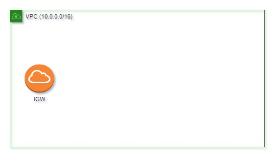

# AWS Configuration EC2 + RDS with CloudFormation

## Introducing

I will keep it short.
This article shows how to configure an application + db on AWS services by using CloudFormation.
Let's jump right in!

## Fast track for mature guys

For those, how is aware how to deploy apps in AWS or for those, how hate to read:
There is a link to the github repo[attach a link] with all resources.

## Design

We are going to configure the following schema:


Down below, I explain each of the component from the design with pictures, ~~cats,~~code, and my bad English

## Creating infrastructure

I've made the `CF-Vpc.yaml` CloudFormation template which is responsible for infrastructure
There are couple details that I would like to describe:
1. The IGW(InternetGateway) allow us to assept traffic from the internet.
2. The PublicRouteTable associates the traffic from IGW to our PublicSubnet, so the WebApp is happy to recieve requests.
3. The DBRouteTable associates with private subnets and covers by InternalTraffic security group, as a result, DB can be called by instances which are belongs to the VPC. 
4. The WebApp connects to the DB as he is a part of VPC.
> **_NOTE:_**  There are two private subnets, because AWS required to have at least two subnets for a RDS instance.

To many words, no code and just one big picture on top. Sounds bad.
Let's fix it! 
For example, we take a look how the point 2 could be configured by CloudFormation and visualized by schemas.

First things first we create the VPC
```yaml
Parameters:
  VPCCidrBlock:
    Type: String
  ...
Resources:
  VPC:
    Type: AWS::EC2::VPC
    Properties:
      CidrBlock: !Ref VPCCidrBlock
  ...
```


Creating the Internet Gateway, for now it's attached to nothing, that's why the IGW outside of VPC
```yaml
Resources:
  IGW:
    Type: AWS::EC2::InternetGateway
    Properties: {}
  ...
```


Here we go, now the IGW has been attached to our VPC
```yaml
Resources:
  VPCInternetGatewayAttachment:
    Type: AWS::EC2::VPCGatewayAttachment
    Properties:
      InternetGatewayId: !Ref IGW
      VpcId: !Ref VPC
  ...
```


The object will help us to connect to a Subnet, for now is just stays in the VPC
```yaml
Resources:
  PublicRouteTable:
    Type: AWS::EC2::RouteTable
    Properties:
      VpcId: !Ref VPC
  ...
```


The Subnet which is has a range of addresses and placed into VPC with an AvailabilityZone
```yaml
Parameters:
  PublicAvaliabilityZone:
    Type: AWS::EC2::AvailabilityZone::Name
  PublicCidrBlock:
    Type: String
  ...
Resources:
  PublicSubnet:
    Type: AWS::EC2::Subnet
    Properties:
      AvailabilityZone: !Ref PublicAvaliabilityZone
      CidrBlock: !Ref PublicCidrBlock
      VpcId: !Ref VPC
      MapPublicIpOnLaunch: true # This will indicate that all instances launched on the subnet receive public IPv4 addresses  
  ...
```


The step when we make a bridge between RoutTable and our Subnet
```yaml
Resources:
  PublicSubnetRouteTableAssociation: 
    Type: AWS::EC2::SubnetRouteTableAssociation
    Properties:
      RouteTableId: !Ref PublicRouteTable
      SubnetId: !Ref PublicSubnet
  ...
```


The bridge between RoutTable and our IGW(Just an arrow between those two)
```yaml
Resources:
  PublicIGWRoute: # 
  Type: AWS::EC2::Route
    Properties:
      GatewayId: !Ref IGW
      RouteTableId: !Ref PublicRouteTable
      DestinationCidrBlock: 0.0.0.0/0
  ...
```


And finally the security group which is opens the traffic from the internet
```yaml
Resources:
  PublicTraffic:
    Type: AWS::EC2::SecurityGroup
    Properties:
      VpcId: !Ref VPC
      SecurityGroupIngress:
        CidrIp: 0.0.0.0/0
        FromPort: 8080
        ToPort: 8080
        IpProtocol: tcp
      GroupDescription: public access
  ...
```


> The steps above show how the different types of Resources interact with each other, some of them need to create objects other is need to make relationships

## Configure RDS

The CloudFormation stack with environment have been configured.
Let's configure DB to put it in FirstDBSubnet by creating a separate CloudFormation template

The following configuration provided within the `CF-db.yaml` file

Most likely we just need to specify the database parameters such as storage, engine and other database specifics as well as credentials
But I would like to highlight the security group, so the DB will not be totally death and at least WebApp(that's all we need) will be able to query it.
```yaml
Parameters:
  InternalTraffic:
    Type: AWS::EC2::SecurityGroup::Id
  ...
Resources:
  DB:
    Type: AWS::RDS::DBInstance
    Properties:
      ...
      VPCSecurityGroups:
        - !Ref InternalTraffic
  ...
```

One more thing, the two subnets for DB have to be specified together by `DBSubnetGroup` 

```yaml
Parameters:
  FirstDBSubnet:
    Type: AWS::EC2::Subnet::Id
  SecondDBSubnet:
    Type: AWS::EC2::Subnet::Id
  ...  
Resources:
  DBSubnetGroup:
    Type: AWS::RDS::DBSubnetGroup
    Properties:
      DBSubnetGroupDescription: Access to db
      SubnetIds:
        - !Ref FirstDBSubnet
        - !Ref SecondDBSubnet
  ...
```

## Configure EC2

Last but not least, we need to configure WebApp for PublicSubnet by creating a separate CloudFormation template

The following configuration provided within the `CF-app.yaml` file

I insist on looking a bit closer to the WebApp Resources
I will walk through you for each Property
```yaml
Parameters:
  PublicSubnet:
    Type: AWS::EC2::Subnet::Id
  InternalTraffic:
    Type: AWS::EC2::SecurityGroup::Id
  PublicTraffic:
    Type: AWS::EC2::SecurityGroup::Id
  ...
Resources:
  WebApp:
    Type: AWS::EC2::Instance
    Properties:
      SecurityGroupIds:
        - !Ref InternalTraffic
        - !Ref PublicTraffic
      SubnetId: !Ref PublicSubnet
      InstanceType: t2.micro
      IamInstanceProfile: !Ref WebAppInstanceProfile
      ImageId: ami-0a261c0e5f51090b1
      UserData:
        Fn::Base64:
          !Sub |
          #!/bin/bash
          mkdir java
          cd java
          sudo yum install java-17-amazon-corretto-devel -y
      Tags:
        - Key: "EC2Instance"
          Value: "WebApp"
  ...
```
Properties:
- `SecurityGroupIds`: InternalTraffic to connect to the DB, PublicTraffic to receive calls from the internet
- `SubnetId`: Inject the WebApp to PublicSubnet configured in **Creating infrastructure** charter
- `InstanceType`: The free tier eligible type. 
- `IamInstanceProfile`: The Roles that could be attached to your EC2 instance to call other AWS services.
- `ImageId`: I will use the System Manager, that's required to have the TLS certificate for an instance. All AWS AMI already have TLS certificates ([AWS docs](https://docs.aws.amazon.com/systems-manager/latest/userguide/setup-launch-managed-instance.html)), so I've picked up on of them(That's why I hardcoded this one)
- `UserData`: The property allow us to run shell script then on startup of instance. So you probably have an idea to write the script which will run your app, but I think the provisioning infrastructure process and deploying application process could change for different reason at different time, so they have to be strongly decoupled. I use the UserData to provision infrastructure by preinstalling jdk. For the deployment I will use System Manager(in nutshell SSM provides ability to run scripts on your instances)
- `Tags`: The tag helps to identify the instance in the future on the deployment process.


`IamInstanceProfile` could be huge and mysterious. The down below I've split into the pieces for you:

The object is just set of Roles for your instance. By the way I have a article with explanation of Roles by examples with the dogs(TODO add link).
```yaml
Resources:
  WebAppInstanceProfile:
    Type: AWS::IAM::InstanceProfile
    Properties:
      Roles:
        - !Ref WebAppRole
  ... 
```

`WebAppRole` - consist of two policies. They present a bad and good example respectively.
The `WebAppSSMPolicyArn` - needs to execute scripts in the instance by SSM. It's bad Policy example, since we have access to all action and resources(Don't do that at home).
The `WebAppS3Policy` - needs to get the jar file with an app from S3 bucket. It's good Policy example, since we provide necessary resources and actions only. There is no place to create or update something in S3, we are allowed to read only.
```yaml
Parameters:
  WebAppRoleName:
    Type: String
  WebAppSSMPolicyArn:
    Type: String
    Default: arn:aws:iam::aws:policy/AmazonSSMFullAccess  
  ...
Resources:
  WebAppRole:
    Type: AWS::IAM::Role
    Properties:
      RoleName: !Ref WebAppRoleName
      AssumeRolePolicyDocument:
        Version: '2012-10-17'
        Statement:
          - Effect: Allow
            Principal:
              Service:
                - ec2.amazonaws.com
            Action:
              - sts:AssumeRole
      Path: "/"
      ManagedPolicyArns:
        - !Ref WebAppSSMPolicyArn
        - !Ref WebAppS3Policy

  WebAppS3Policy:
    Type: AWS::IAM::ManagedPolicy
    Properties:
      PolicyDocument:
        Version: 2012-10-17
        Statement:
          - Effect: Allow
            Action:
              - s3:Get*
            Resource:
              - arn:aws:s3:::src-articles/*
              - arn:aws:s3:::src-articles
  ...
```

## Getting all together

So far we have three CloudFormation templates, we need to create each of them one by one and pass Parameters correctly.
Sounds that we could automate those actions somehow.
We need
Well...
What is better than three CloudFormation templates?
Right!
Four CloudFormation templates.

I've created the `CF-parent.yaml` this template is a manager to correctly provision each stack

We are going to use the `AWS::CloudFormation::Stack` Resource only. 
He creates stack from `TemplateURL` and injects parameters from `Parameters` section into the template.
On top of that, we use the `DependsOn` field to make the relation between our stacks.

```yaml
Resources:
  VpcStack:
    Type: AWS::CloudFormation::Stack
    Properties:
      TemplateURL: https://src-articles.s3.eu-central-1.amazonaws.com/ec2-rds/CF-vpc.yaml
      Parameters:
        ...
  DBStack:
    Type: AWS::CloudFormation::Stack
    DependsOn:
      - VpcStack
    Properties:
      TemplateURL: https://src-articles.s3.eu-central-1.amazonaws.com/ec2-rds/CF-db.yaml
      Parameters:
        ...
  WebAppStack:
    Type: AWS::CloudFormation::Stack
    DependsOn:
      - VpcStack
      - DBStack
    Properties:
      TemplateURL: https://src-articles.s3.eu-central-1.amazonaws.com/ec2-rds/CF-app.yaml
      Parameters:
        ...
```

## Deployment

A lot of information for today :)
You're tiered to read, I'm tiered to write.
I purpose to make both of us a bit happier.
So if you are willing to get know how I run an app on those stacks, go ahead and read the next article.
Deployment of your dream[link to deployment article]

##Conclusion

Finally, you are hero, you've made it. You read whole text. Thank you for that!
Any question? Suggestion? Mistakes?
Feel free to comment anything that cross your mind. I would love to respond

