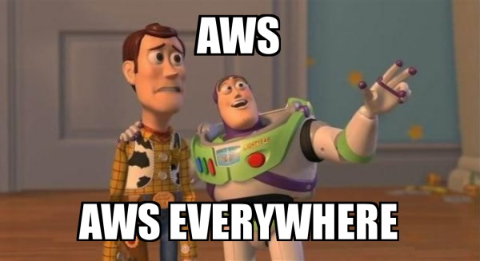
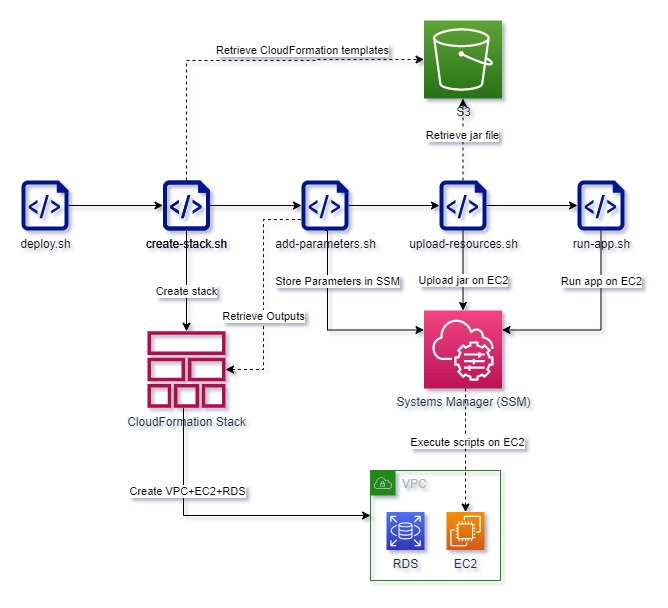

# AWS Deployment EC2 + RDS with aws cli

<div>
  
</div>
<br>


## Introducing

Previously I've created a couple of CloudFormation templates to provision infrastructure, you can find the description right [here](CONFIGURATION.md)

Today we are moving forward, so I'm going to show you how to set up a Java web-app for the environment.
I've provided 5 bash scripts powered by aws-cli:
1. `create-stack.sh` - Responsible for creating stack in AWS by running the [parent](CF-templates/CF-parent.yaml) CloudFormation template.
2. `add-parameters.sh` - Retrieving `Outputs` from CloudFormation stacks and storing them in SSM, so the parameters will be handy.
3. `upload-resources.sh` - Uploading a jar file from the `S3` bucket to the EC2 instance.
4. `run-app.sh` - As simple as it sounds, just run the java app with essential parameters.
5. `deploy.sh` - The "parent" script. He injects environment variables and handles the execution of all scripts described above.

I used to talk a lot, but I would visualize the process for you.
That is how all the jazz is living in my head:

<div>
  
</div>
<br>

### Couple of words about SSM
SSM(stands for "Systems Manager") - it is a service provided by Amazon Web Services (AWS) that allows you to manage your resources and applications running on AWS infrastructure.
With SSM, you can automate operational tasks such as patch management, instance configuration, and resource management, allowing you to streamline your operations and reduce human errors.

For example, you can store and alter parameters to use in the future, it's kinda environment variables on the AWS layer
```shell
aws ssm put-parameter \
               --name "DbUrl" \
               --value "http://url.for.your.db.com" \
               --type String \
               --overwrite
```

On top of that, you are allowed to run any scripts on your EC2 instances -> for example take a look at the [run-app.sh](deploy/run-app.sh) file.
Firstly, I assembled all parameters from SSM with the following syntax:
```shell
javaParams='-DDB_HOST={{ssm:DbUrl}} -DDB_PORT={{ssm:DbPort}} -DDB_NAME={{ssm:DbName}} -DDB_USERNAME={{ssm:DbUsername}} -DDB_PASSWORD={{ssm:DbPassword}}'
```
The SSM will retrieve the parameters by declaration `{{ssm:parameterName}}`

And then I executed `command` for the appropriate EC2 instance:
```shell
aws ssm send-command \
--document-name "AWS-RunShellScript" \
--targets "Key=InstanceIds,Values=${WEB_APP_INSTANCE_ID}" \
--parameters '{"commands":["#!/bin/bash", "java -jar '"${javaParams}"' '"${WEB_APP_JAR_FILENAME}"'"]}' \
--output text 
```

## Execution
**How to reproduce:**
* Create an IAM role (use Admin permissions, but only at home when nobody can see it)
* Add resources to your S3 bucket(CF templates and jar file)
* Specify appropriate names and resources paths in [`deploy.sh`](deploy/deploy.sh) file.
* Run the parent script `bash deploy.sh`.
* ~~star the repo~~Make a cup of coffee and wait until the program will have finished.

## Cry from the heart

I've seen in many articles how guys ask to not judge them since they don't have a lot of experience and it's the first post, first step, at the end they learned how to make a bicycle minutes before they publish the post
So they ask don't judge them on newly learned things.
Why nobody says, something like: "Hey I am a Senior HTML Developer with hundreds of years of experience and four DS degrees, I am extremely sure that my post won't be a place for a mistake. Go ahead read it and treat it as absolute truth."

I won't tell you how long I am working with a tool, but If you have a piece of thinking that something is wrong with the article.
I will be extremely pleased if you point to the thing in the comments down below.

Thank you for your attention!

**LinkedIn** -> [Profile](https://www.linkedin.com/in/pichkasik/)

**Gmail** -> pichkasik.dev@gmail.com